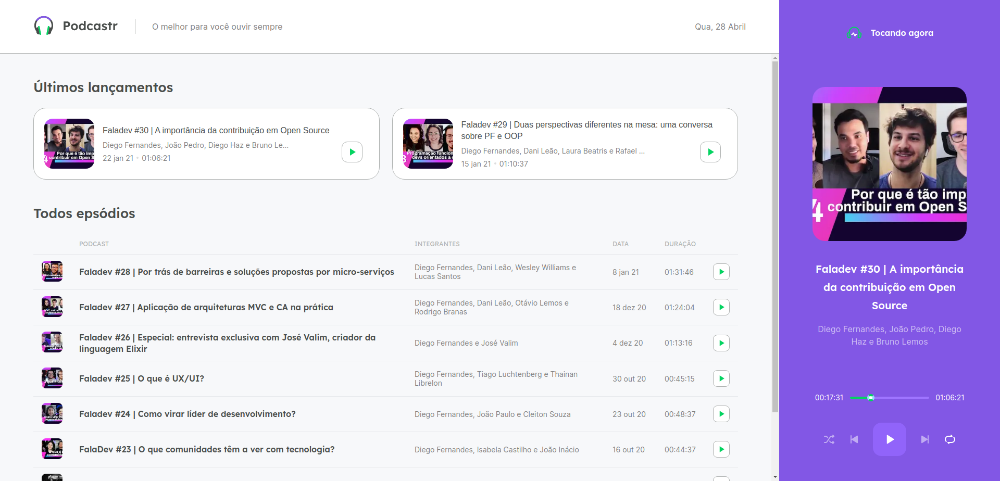

<p align="center">
  
</p>

<h4 align="center">
  Uma solução de podcasts.   
</h4>

<h4 align="center">
  Podcast app.
</h4>

<p align="center">
  <a href="#rocket-technologies">Technologies</a>&nbsp;&nbsp;&nbsp;|&nbsp;&nbsp;&nbsp;
  <a href="#information_source-how-to-use">How To Use</a>&nbsp;&nbsp;&nbsp;
</p>

<h4 align="center">
  Demo (Home)
</h4>
<p align="center">
  
</p>

<h4 align="center">
  Demo (Episódio)
</h4>
<p align="center">
  
</p>

## :rocket: Technologies

This project was developed with the following technologies:

- [Next.js](https://nextjs.org/)
- [SASS](https://sass-lang.com/)

## :information_source: How To Use

```bash
# Clone this repository
$ git clone https://github.com/igor-marchi/proffy podcastr
# Install dependencies
$ cd yarn or npm -i
# Start server
$ cd yarn server
# Start project
$ yarn or npm dev
```

Made with ❤ [Igor Marchi](https://www.linkedin.com/in/igor-marchi/) :laughing:
